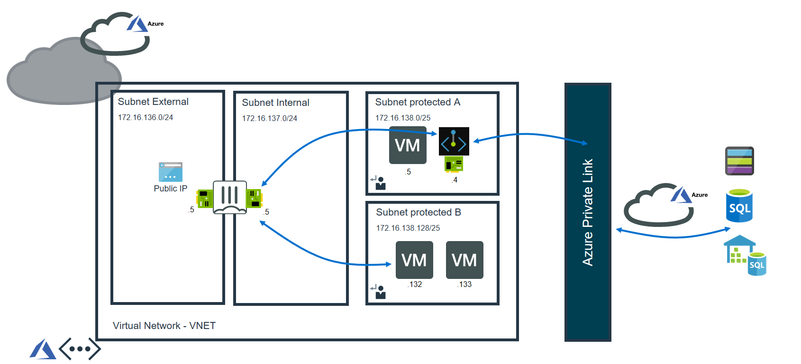

# Private Endpoint integration with FGT

## Introduction

Private endpoint allow you to connect privaely and securely to azure PAAS service such as Azure Storage and Azure SQL database.
Private endpoint will be linked to azure service. It uses interface with private IP address from your Vnet.
We will interoduce here Fortient solution to integrate FGT with private endpoint. 
This will allow FGT to inspect all traffic between client machines and Private endpoint.

## Design

The ARM template will deploy here the following components:
1 Vnet with for subnets:
internal subnet for FGT internal interface 
external subnet for FGT external interface
ProtectedSubnetA where the private endpoint is located
ProtectedSubnetB where the client windows machines can be deployed 
Single FGT Vm with two interfaces which are located in internal and external subnets.
1 public IP address attached to FGT external interface
Private endpoint with interface linked to the selected resource (ex: SQL server)
private DNS zone linked to Vnet
Routing table for ProtectedSubnetA
Routing table for ProtectedSubnetB

The traffic should be forwarded from client to FGT internal interface for traffice inspection. 
After that FGT will send the traffic from internal interface to the private endpoint interface.

Private DNS integration with private endpoint is mandatory here. The clients should be able to resolve the server FQDN with the Private endpoint IP address.

You could also verify your private endpoint settings. You can check that the private link resource is linked to the correct service and the connection status is approved.

## Deployment: Azure Portal

Azure Portal Wizard:

Custom Deployment:

## Support

Fortinet-provided scripts in this and other GitHub projects do not fall under the regular Fortinet technical support scope and are not supported by FortiCare Support Services.
For direct issues, please refer to the [Issues](https://github.com/40net-cloud/fortinet-azure-solutions/issues) tab of this GitHub project.

## License

[License](LICENSE) © Fortinet Technologies. All rights reserved.
